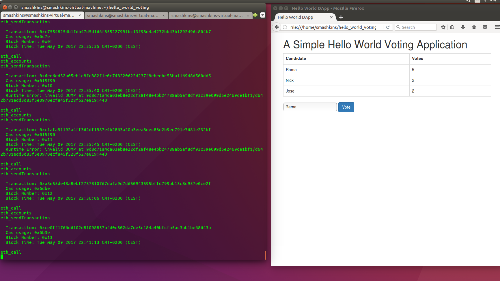

## Ethereum per sviluppatori

Da un pò di tempo mi interesso di sviluppo su piattaforma blockchain anche se lo sviluppo iOS rimane comunque al momento la mia mansione principale.

Sin da quando sono venuto a conoscenza di questa nuova tecnologia sempre più in auge sono rimasto da subito entusiasta. Sul web si trovano numerose discussioni sul tema e numerosi elogi (ma anche alcune critiche) quindi se avete già una infarinatura sull'argomento e conoscete già le potenzialità di quello di cui stiamo parlando e vi interessa subito andare al sodo potete saltare questo paragrafo immediatamente. Per tutti gli altri vorrei spendere qualche parola in più per consentirvi di "acclimatarvi" dicendovi ciò che mi ha più entusiasmato di tutta questa strana vicenda.

### Introduzione per neofiti ###
Se diamo una occhiata ai trends tecnologici degli ultimi decenni noteremo una certa evoluzione dei sistemi analogici verso sistemi più efficienti e digitali. 

Per esempio la posta da cartacea (vi ricordate i francobolli, e chi li usa più?) è diventata elettronica, l'enciclopedia composta da numerosi volumi è diventata wikipedia e internet, la musica e i film da analogici hanno attraversato la fase di digitalizzazione...bene, adesso si stanno concretizzando delle convergenze per cui l'intero sistema finanziario che per la verità già ha attraversato una prima fase di digitalizzazione pur rimanendo indietro in alcuni aspetti per questo generale senso di diffidenza e affidabilità verso la tecnologia, sta per evolversi in un sistema più efficiente in cui i dati verranno scambiati con un costo marginale praticamente nullo...

Se per esempio adesso io posso mandarvi un video girato con il mio smartphone, un video di diversi GB e questo mi costa praticamente nulla lo stesso non si può dire per le transazioni bancarie. Se infatti voglio mandarvi dei soldi per muovere i pochi byte che rappresentano la mia ricchezza e farvi un bonifico, potrò farlo soltanto dalle 9 alle 17 o da lunedì a venerdì e i soldi vi arriverebbero nel giro di 1-2 giorni lavorativi...

Bene, tra 10 anni ci volgeremo indietro e guarderemo a questo sistema come ad un qualcosa di preistorico, non conveniente ed estremamente inefficente.

A questo punto molti di voi staranno pensando che questa strana cosa di cui vi sto per parlare sia un qualche gioco da programmatori informatici ancora ai suoi albori e che al momento rimane ristretta nell'ambito della ricerca e degli esperimenti.

In realtà a tutt'oggi in questo sistema trasitano già numeri estremamente significativi. Il Bitcoin, la prima moneta digitale che si basa su questo nuovo sistema, valeva nell'aprile 2011 qualcosa come 1$ adesso ne vale 1500$... Non conosciamo nient'altro al mondo che si sia apprezzato 1500 volte negli ultimi 10 anni, niente in ambito finanziario e niente in ambito industriale e la capitalizzazione di mercato delle cryptovalute sta raggiungendo cifre ragguardavelovi dell'ordine di diverse decine di milioni di dollari. 

Ai più questo eccessivo interesse sembra piuttosto esagerato e sembrerebbe delineare una qualche forma di bolla speculativa. Secondo il mio parere in parte è così, un pò come fu nei primi anni 90 la bolla delle dot-com, ma così come fu negli anni 90, da quella bolla nacquero numerose società che in seguito hanno rivoluzionato alcuni aspetti della nostra vita.

La cosa che più mi entusiasma di questa tecnologia, oltre all'aspetto finanziario che alimenta la nascita di una nuova branca di sviluppo, la cosiddetta fintech, è il fatto che in ambito digitale sta accadendo una rivoluzione. Infatti fino all'invenzione della blockchain (una struttura dati così come lo è un array, una list etc) non si conosceva nulla che poteva essere trasferito senza essere duplicato, nulla. Tutto ciò cambia con l'avvento della blockchain.

La criptovaluta, che rappresenta una delle possibili applicazioni di questo nuovo protocollo, rappresenta l'invenzione, per la prima volta, di qualcosa che in ambito digitale non può essere duplicato. Se ci pensate, questo è un qualcosa che è realmente sconvolgente perchè null'altro è come la blockchain in ambito digitale.

Già solo per questa sua unicità, la tecnologia meriterebbe un posto in prima fila così come sta pian piano accadendo. Queste invenzioni, di così tale portata, avvengono poche volte nel giro di decenni ed è per questo che il mio interesse, così come quello di tanti altri, è andato sempre più crescendo.

Di solito la maggior parte della gente si avvicina alla blockchain grazie alla popolarità di una delle sue applicazioni, il Bitcoin. 

In questi primi anni di sviluppo ci troviamo di fronte ad una forma di corsa all'oro e sicuramente molti di voi (me compreso) vi siete avvicinati a questo mondo inizialmente attratti dalle notizie di facili guadagni. Ma se siete sviluppatori come me, questo interesse da una prima fase di scetticismo pian piano si trasformerà in un desiderio di capirci di più, entrandoci dentro per comprendere come tutta questa "magia" sia possibile, ed è quello di cui parleremo in questa serie di tutorial pratici in cui viaggeremo in nuovo mondo dove la programmazione incontra e può camminare a braccetto con il ricco mondo della finanza.

### Introduzione per sviluppatori ###

Troviamo numerose risorse su internet riguardo l'argomento Ethereum (video, articoli e documentazioni). Ma, per mia esperienza personale, molte di queste risultano nel giro di poco tempo datate a causa del fatto che la piattaforma è in continua e veloce evoluzione.

**Perchè Ethereum?**

Beh, perchè nella rivoluzione descritta in precedenza, è nata, da una costola, una ulteriore rivoluzione.

Attualmente vedo nascere sempre più progetti che promettono di portare qualche novità e linfa nuova a ciò che già c'è, magari nasceranno nuovi linguaggi ognuna con caratteristiche peculiari, ma Ethereum è stata la prima ad avventurarsi in questo che sto per dirvi, e quindi risulta la madre di tutti gli altri.

Ethereum ha portato con se una semplice ma potente novità: la possibilità di introdurre una piattaforma di sviluppo che facesse uso della blockchain. Con il Bitcoin ciò non era possibile in quanto il bitcoin nasce con l'intento esclusivo di fornire soltanto una applicazione del protocollo che funzionasse esclusivamente da moneta digitale di scambio e nulla più.

In Ethereum, grazie alle gesta di Vitalik Buterin e del suo manipolo di 20 sviluppatori che avevano accumulato 18 milioni di dollari in bitcoin invece il discorso cambia. La struttura dati sottostante, la blockchain, diventa programmabile.

Una blockchain, detta in parole povere, è un modo per organizzare dei computer insieme e fargli fare una stessa cosa. Così come Dropbox o Google Docs o qualsiasi altra tecnologia utilizzata per sincronizzare le foto del pc o dello smartphone. La differenza è che questa sincronizzazione non avviene tra due punti ma tra centinaia di computer sparsi per il mondo.

Se qualcuno di questi punti o nodi va offline o viene hackerato da qualche malintenzionato, il network della blockchain non ne risente minimamente.

Vi sono due curiosità rilevanti riguardo a questo sistema:

* La prima è che la blockchain stessa, questa struttura dati, paga i suoi nodi per mantenerla attiva. La paga nel vero senso della parola. La paga con una delle sue applicazioni, il bitcoin (nel caso della blockchain del bitcoin) o nel nostro caso in ethereum (nel caso della rete ethereum). Questa attività di reward viene chiamata Mining e queste criptomonete hanno un controvalore in moneta fiat (monete correnti come USD o EUR) grazie a degli exchanger che così come nella finanza reale forniscono delle piattaforme online dove è possibile fare attività di scambio a livello globale.

* La seconda curiosità, e forse quella che ci interessa più da vicino, è che Ethereum introduce la programmabilità di questo sistema tramite un linguaggio Turing completo.

Per la prima volta, e questa è una delle grosse novità di cui ho accennato prima, la moneta e gli scambi finanziari diventano programmabili. 

Ma non solo quella, si possono infatti pensare altri campi di applicazione dove può intervenire il concetto di non replicabilità descritto prima, come ad esempio un contratto notarile, un voto, ma anche sulle proprietà intellettuali dando per esempio l'opportunità di far pagare esattamente bit dopo bit la quantità di dati scambiati e quindi del costo di fruizione di un servizio in streaming man mano che i dati fruiscono all'utente e non più in maniera forfettaria come avviene oggi ad esempio su Netflix.

Svariate sono i campi di sviluppo e ogni giorno nascono nuove idee che si concretizzano in nuove ICO, nuovi token ognuna delle quali rappresenta una declinazione del protocollo e quindi di una idea etc...ma di questo ne parleremo successivamente. Ritorniamo al nostro tema principale.

Ho impiegato diverso tempo a mettere i pezzi del puzzle insieme ed avere un quadro chiaro e completo di ciò che è Ethereum e di come funziona a livello di sviluppo. Quello che cercherò di fare quindi in questa serie di tutorial è presentare un quadro organico di come uno sviluppatore può immediatamente iniziare a giocarci. In alcuni punti non mi soffermerò tanto sulle spiegazioni, rimandando per questo ai riferimenti che lo spiegano in maniera più dettagliata.

Ovviamente tutto ciò che è scritto qui è frutto di ricerche e riferimenti trovati in rete. Ho preso quindi spunto qui e lì anche per scrivere alcune parti di questi tutorial. Il mio scopo è quello di poter leggere in un unico posto ciò che si trova spezzettato qui e lì, eliminando le strade che portavano ad errori e non funzionano e integrando ciò che invece ha dato risultati pratici.

Nel prossimo tutorial finalmente ci sporcheremo le mani e introdurrò brevemente all'archiettura Ethereum per poi sviluppare la nostra prima Decentralized App.