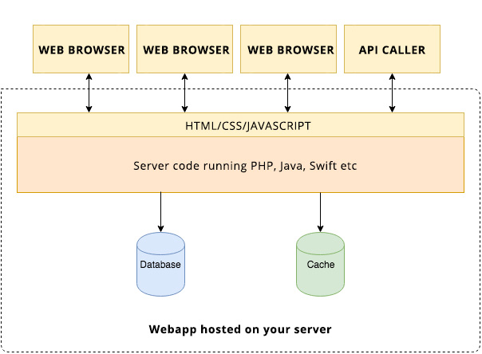
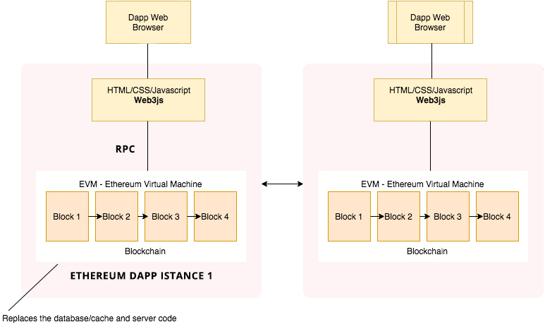

## Architettura Ethereum

Partiamo dalla classica architettura web client server.

Abbiamo diversi browser che fungono da client con un frontend in HTML/CSS etc ed un codice server scritto in php, java etc che si collega a un database il tutto hostato su di un server

Quando un client effettua delle richieste al server il server fa la "magia", parla con il database o la cache, scrive legge e aggiorna il database e restituisce il dato al client.

Questa architettura funziona bene per la maggior parte delle applicazioni, tuttavia vi sono certe applicazioni che trarrebbero vantaggio dall'avere un database pubblico, accessibile in sicurezza da chiunque e in cui i tuoi dati non sono affidati al proprietario dell'applicazione.

Per esempio, diamo un occhiata ad eBay. Sei un power seller che ha guadagnato una moltitudine di reviews positive e per un motivo *x* eBay ad un certo punto decide di sospendere il tuo account. 

Sicuramente questo avrebbe un impatto significativo sul tuo business. Addio review, addio rating, addio alla reputazione che ti sei gudagnato in lunghi anni di carriera. Nel frattempo però è nata una nuova piattaforma gemella: non detiene i tuoi dati, ne prende commissioni tra buyer e seller.

Non detiene i tuoi dati ne prende commissioni
 

Storci subito il naso. Sei scettico. Impossibile. Come può una piattaforma del genere far soldi, sostenersi e mantenersi? Potere delle applicazioni decentralizzate amico mio, ma non essere frettoloso, lo capirai tu stesso alla fine del tuo percorso all'interno di questa rivoluzione.

Torniamo all'archiettura Ethereum.

Ethereum rende relativamente semplice la costruzione di queste app decentralizzate o Dapps (decentralized applications).

Questo è uno schema di come è costituita ad alto livello una Ethereum Dapp:

Alcune cose che vorrei mettere in risalto:

* Ogni Client (Web Browser) comunica con la propria istanza di applicazione DApp che si trova quindi in locale sulla macchina dell'utente.

* Non esiste un server centrale al quale tutti i client si connettono. Esiste invece la blockchain che è una struttura dati distribuita (una specie di libro mastro dove vengono memorizzate diverse informazioni) dove ognuno che vuole fare da nodo ha la sua copia che si sincronizza con le altre. 
 

Il secondo punto appena descritto (e qui sta la genialata che a primo acchitto sembrerà una stupidata) implica che ogni persona che vuole interagire con una **Dapp** (decentralized application) ha bisogno della copia intera della blockchain in running sulla proprio pc o smartphone. 

Ciò significa che prima di poter usare un applicazione si avrà la necessità di scaricare l'intera blockchain e quindi successivamente usare l'applicazione.

So cosa vi state chiedendo: è ridicolo tutto ciò. E' la stessa domanda che mi sono fatto io. Impensabile che un utente prima di usare una webapp debba scaricarsi (o se già l'ha fatto, sincronizzarsi) l'intera blockchain (che attualmente è di diverse decine di giga e cresce sempre di più!!). 

Ovviamente gli sviluppatori che hanno ideato il sistema non sono così cretini e fuori dal mondo e hanno pensato ad una soluzione che tra non molto leggerete. Intanto capiamo un vantaggio di questa soluzione:

**I DATI NON VENGONO RELEGATI A UN SINGOLO SERVER CENTRALE CHE POTREBBE SCOMPARIRE DOMANI**

Ma cosa è esattamente questa blockchain?

1. **Database**: Un paio di transazioni che avvengono nel network Ethereum sono impacchettati in blocchi ed ogni blocco è linkato al prossimo blocco. Questa serie di blocchi collegati è la blockchain. Per essere sicuri che ogni nodo della rete abbia la stessa copia di dati e non abbia dati invalidi Ethereum usa un algoritmo preso in prestito dal protocollo Bitocoin, l'algoritmo Proof of Work (http://ethereum.stackexchange.com/questions/14/what-proof-of-work-function-does-ethereum-use). Ethereum passerà ad un certo punto della sua storia ad un'altro tipo di algoritmo, un algoritmo di tipo Proof of Stake chiamato Casper, ma questo discorso esula dal nostro tema principale perciò invito chi interessato a trovare informazioni in merito via google.

2. **Codice**: Il Database visto nel primo punto è la parte della blockchain atta allo store dei dati. Ma dove sta la logica per comprare, vendere, cancellare e riassegnare tutto quanto? Nel mondo Ethereum la logica sta nel codice che tu sviluppatore scrivi per l'applicazione che vuoi creare. Questa logica si chiama contratto (o **smart contract**) e lo fai in un linguaggio chiamato **Solidity**. Una volta scritto il tuo smart contract, il compilatore solidity compila il codice in Ethereum Byte Code ed effettua il deploy sulla blockchain.

Quindi riassumendo, la blockchain memorizza i dati, memorizza il codice ed esegue il codice nella **Ethereum Virtual Machine**.

Per costruire dapps web based (ma ho intenzione in una seconda serie di questi tutorial introdurre allo sviluppo di dapps native per mobile iOS), Ethereum dispone di una comoda libreria javascript chiamata **web3.js** la quale permette di connetterti al tuo nodo della blockchain. 

E' possibile quindi includere tale libreria in un qualsiasi js framework come reactjs, angularjs etc e iniziare a programmare.

Per ultimo volevo lasciarvi al termine di questa seconda parte, accennando ad un'altra importante feature e cioè alle capacità finanziarie della piattaforma. Sai che non appena inizi ad utilizzare una dapp è come se aviassi un conto bancario virtuale e che puoi creare quanti conti bancari desideri nella frazione di un secondo? Questi conti bancari vengono chiamati **wallet** e nei wallet puoi depositare moneta (Ether, la moneta utilizzata nell'ecosistema Ethereum) o effettuare transazioni.

Ci sono innumerevoli dettagli che si potrebbero spulciare riguardo la blockchain ma mi fermo qui per continuare la nostra discussione sulla costruizione di una dapp. Spero che questa seconda parte ti abbia dato una idea di massima ad alto livello dell'architettura di Ethereum e del fatto che con esso sia possibile sviluppare applicazioni decentralizzate. 

Ma dopo questo excursus necessario, adesso possiamo passare finalmente alle cose pratiche!

Nella 3 parte inizieremo a mettere mano sul codice e a sviluppare il nostro primo hello world!

